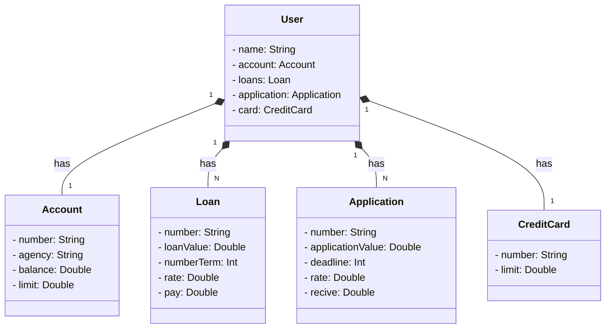

# Santander Operacoes-2023
Java RESTful API criada para desafio de projeto para o Bootcamp Santander.

## Diagrama de Calsses

```mermaid
classDiagram
    class User {
        - name: String
        - account: Account
        - loans: Loan
        - application: Application
        - card: CreditCard
    }

    class Account {
        - number: String
        - agency: String
        - balance: Double
        - limit: Double
    }

    class Loan {
        - number: String
        - loanValue: Double
        - numberTerm: Int
        - rate: Double
        - pay: Double
    }

    class Application {
        - number: String
        - applicationValue: Double
        - deadline: Int
        - rate: Double
        - recive: Double
    }

    class CreditCard {
        - number: String
        - limit: Double
    }

    User "1" *-- "1" Account : has
    User "1" *-- "N" Loan : has
    User "1" *-- "N" Application : has
    User "1" *-- "1" CreditCard : has
```
